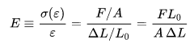
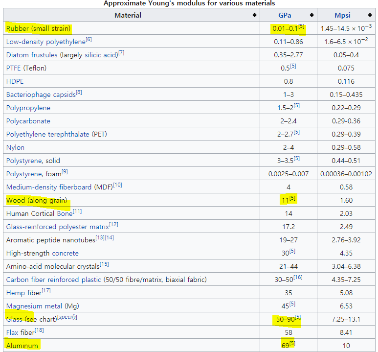
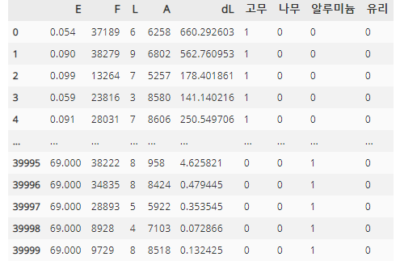
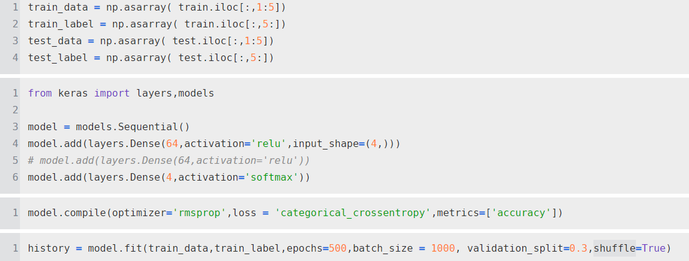
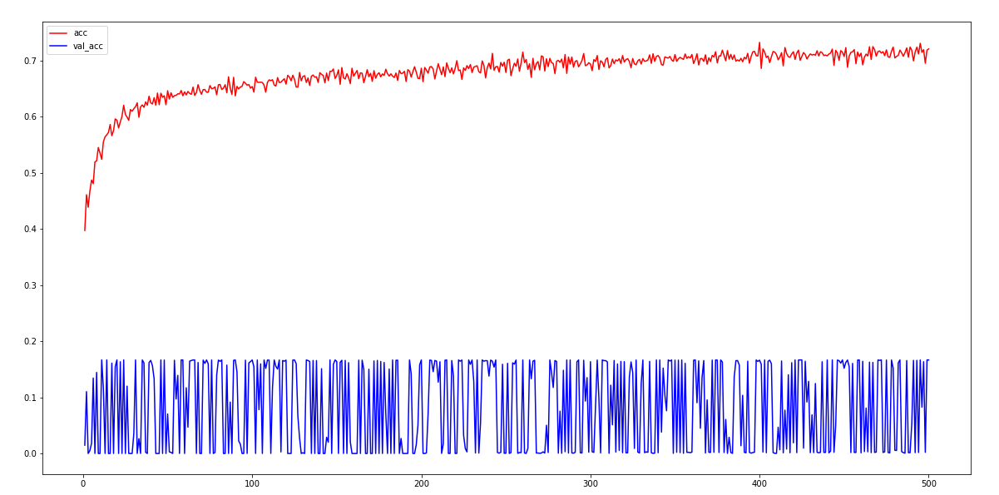
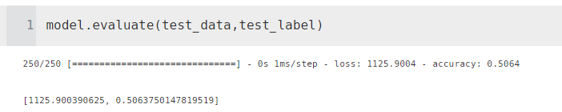

# mini project

> 딥러닝의 은닉 층, 은닉 유닛을 통해서 공식으로 유도할 수 있을까?

공식

영의 탄성계수를 구하는 공식으로 힘( F ) ,  면적( A ), L0( 초기 길이 ), dL( 길이 변화량 )를 나타낸다.

영의 탄성 계수는 물성치로 고무, 나무, 유리, 알루미늄을 분류할 수 있는 지 확인

충분한 데이터를 가지기 위해서 4만 개 데이터 생성

힘(F)은 1N ~ 40,000 N까지

영의 탄성계수는 각 종류별 1만개씩 

면적의 범위는 10 ~ 10000(mm^2)  랜덤으로 4만개 생성

초기 길이 1 ~ 10 (m) 랜덤으로 4만개 생성

길이 변화량은 위의 값의 종속되도록 저장

인덱스 설명

1~ 10000 고무

10001 ~ 20000 나무

20001 ~ 30000 유리

30001 ~ 40000 알루미늄

데이터 프레임

- 라벨과 연관이 높은 영의 탄성 계수는 빼고 훈련 시작

test 데이터 평가

정확도 50%.... 아직 진행 중

