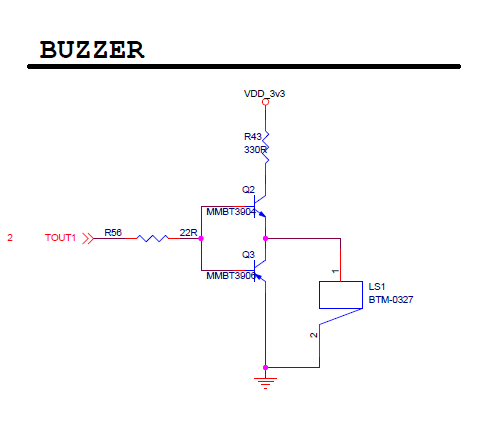
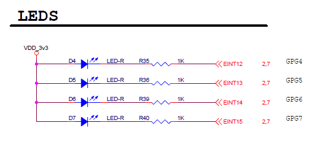
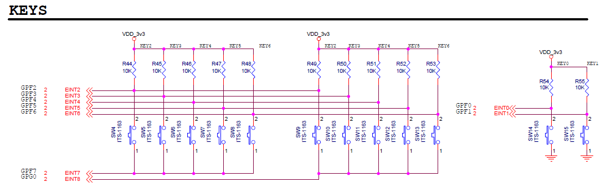
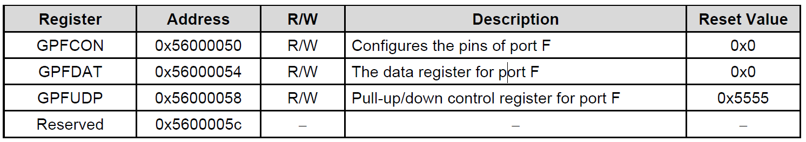
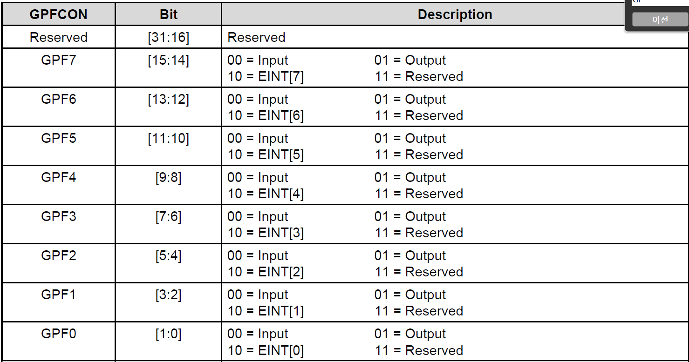
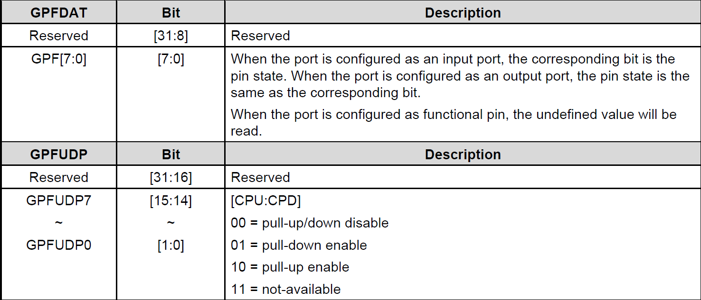

# MCU 보드 제어 프로젝트

> MDS 2450 보드를 이용하여 LED, Key, buzzer를 제어하는 프로젝트
>
> 1주차 C언어를 활용한 프로젝트 ( 총 제작 기간 하루 )
>
> 프로젝트 역할 : Key.c 코딩
>
> 개발 환경 : 우분투 10.0 ( 윈도우 가상 환경 ) , MDS2450 보드 ( ARM core ) , Tera term ( 터미널 )
>
> 개발 방식 : 윈도우에서 가상환경 우분투를 설치한다.  tera term을 통해 보드와 tftp 통신하여 보드에 데이터 전송. ( 호스트 : 컴퓨터, 타킷 보드 : MDS 2450 )
>
> * TFTP란?
>
>   UDP 상에서 이루어지는 간단한 파일 전송 ( File Transfer Protocol )
>
>   통상 클라이언트/ 서버 간에 FTP 같이 복잡한 상호 동작이 필요하지 않는 응용에 많이 쓰인다.
>
> core : 삼성 S3C2450 ( ARM926EJ ) 프로세서

## 1. 프로젝트 목적

1. c 언어 능력 향상
2. 리눅스 환경 적응
3. 임베디드 시스템 환경 적응
4. 학습 내용 응용 및 복습

## 2. 프로젝트 진행

1. MDS 2450.pdf 데이터 시트에서 회로도 확인

   

   

   

2. S3C2450  ( ARM926EJ ) 에서 LED, Key, buzzer의 레지스터 비트를 통해서 기본 상태와 INPUT, OUTPUT 설정

3. KEYS의 레지스터 주소 GPFCON 설정, GPFDAT 값을 변경

   

    

   

   

## 3. 결과물

1. 버튼을 누르면 LED 쌓는 방향 전환
2. 좌버튼은 좌측으로 쌓이고 우 버튼은 우측을 쌓인다.
3. 불빛이 바뀔 때마다 부저 울린다.

