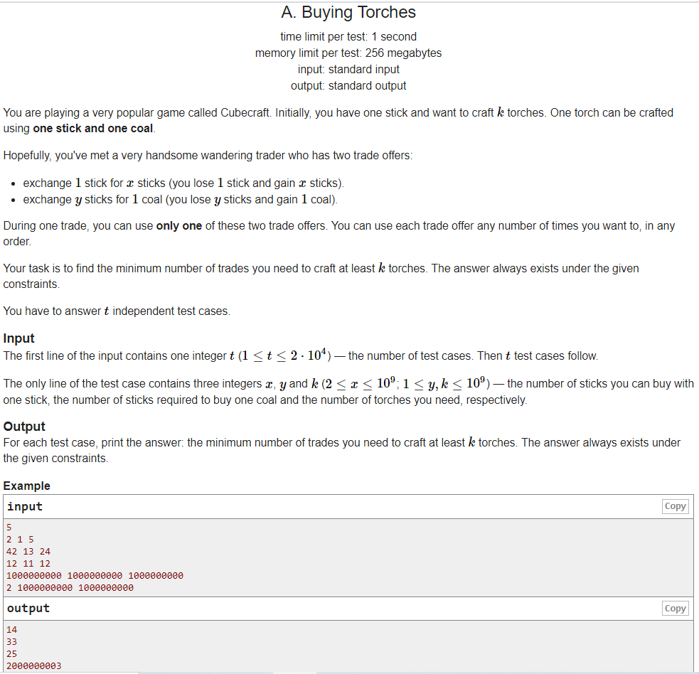

# 코드포스 번역

## 목적

> 코딩 테스트는 문제를 정확히 이해하고 풀어야 프로그래밍을 할 수 있다. 시간이 많다면 정확하게 영어 문장을 해석하며 풀겠지만 테스트는 한정된 시간 내에 문제를 풀어야 하기 때문에 시간 절약이 중요하다. 
>
> 그리고 수학 수식이 많은 코딩 테스트는 그대로 번역기에 넣을 시 수학 수식과 HTML 기호가 같이 딸려나와 불편함이 있다.
>
> 시간 절약과 조금 더 정확한 번역을 위해 번역 코드를 만들었다.



```
당신은 큐브크래프트라고 불리는 매우 인기 있는 게임을 하고 있습니다. 처음에, 당신은 하나의 막대기를 가지고 있고 K 횃불을 만들고 싶어한다. 하나의 횃불은 하나의 막대기와 하나의 석탄을 사용하여 만들 수 있습니다. 희망컨대, 당신은 x 막대기와 교환 1 스틱을 교환하고 x 막대기를 얻는 두 가지 무역 제안을 가진 매우 잘생긴 방랑 무역업자를 만났습니다. Y 스틱을 1탄으로 교환한다(Y 스틱을 잃어서 1탄을 얻는다). 한 거래 동안, 당신은 이 두 가지 거래 제안 중 하나만 사용할 수 있다. 어떤 순서로든 원하는 수의 거래 오퍼를 사용할 수 있습니다.당신의 임무는 최소한 k개의 횃불을 만드는 데 필요한 최소 거래 수를 찾는 것입니다. 정답은 항상 주어진 제약 조건 하에 존재합니다.독립적인 시험 사례에 답해야 합니다.
You are playing a very popular game called Cubecraft. Initially, you have one stick and want to craft k torches. One torch can be crafted using one stick and one coal.Hopefully, you've met a very handsome wandering trader who has two trade offers:  exchange 1 stick for x sticks (you lose 1 stick and gain x sticks).  exchange y sticks for 1 coal (you lose y sticks and gain 1 coal). During one trade, you can use only one of these two trade offers. You can use each trade offer any number of times you want to, in any order.Your task is to find the minimum number of trades you need to craft at least k torches. The answer always exists under the given constraints.You have to answer t independent test cases.
====================================================================================================


====================================================================================================
입력 입력의 첫 번째 줄에는 하나의 정수 t(1 <= t <= 2 * 104)가 포함되어 있는데, 이는 테스트 케이스 수입니다. 그 다음 t 테스트 케이스가 뒤따른다.시험 케이스의 유일한 라인은 3개의 정수 x, y 및 k (2 <= x <= 109; 1 <= y, k <= 109) - 막대기로 살 수 있는 막대기 수, 석탄 1개를 사는 데 필요한 막대기 수 및 필요한 횃불 수입니다.
InputThe first line of the input contains one integer t (1 <=  t <=  2 * 10^4) — the number of test cases. Then t test cases follow.The only line of the test case contains three integers x, y and k (2 <=  x <=  10^9; 1 <=  y, k <=  10^9) — the number of sticks you can buy with one stick, the number of sticks required to buy one coal and the number of torches you need, respectively.
====================================================================================================


====================================================================================================
각 테스트 케이스의 출력에 대한 답변을 인쇄하십시오. 최소 k개의 횃불을 만드는 데 필요한 최소 거래 수입니다. 정답은 항상 주어진 제약 조건 하에 존재한다.
OutputFor each test case, print the answer: the minimum number of trades you need to craft at least k torches. The answer always exists under the given constraints.
====================================================================================================
```


## 쓰기 위해서는 ...


### 파이썬 라이브러리

urllib

bs4 

re

time

selenium


### 크롬 드라이버

https://chromedriver.chromium.org/


### 코드 포스 URL 

ex) https://codeforces.com/problemset/problem/1418/A


